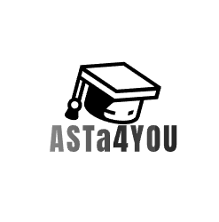

[Zurück](../inhalt.md)

## Einleitung
Das Webseiten-Projekt ASTA4You, dient dazu mehr auf die ASTA aufmerksam zu machen, da Studenten heutzutage eher im Internet als Analog unterwegs sind.
+ Name:Rinkel
+ Vorname:Maximilian
+ Studiengang: AI

## Wir
Das Ziel der Website ist es, Studenten anzusprechen, und diese dazu zu Bewegen auch bei der ASTA4You mitzuwirken, da Studenten meist relativ junge Leute sind und somit eine große Surferfahrung aufweisen, kann man die Website sehr intuitiv gestalten , sollte aber auch aufgrund der Altersgruppe ein modernes Layout und Design wählen, welches ansprechend für junge Menschen ist.Außerdem sollte die Website über einfache Funktionen, wie zum Beispiel das einschreiben bei der ASTA4You verfügen und diese ziemlich simpel und somit ohne großen Aufwand halten.

## Grobplanung
1. nav_1
    - [Home](doc/Home.md)
        - [Wir](doc/Wir.md)
            - [Aktuelles](doc/Aktuelles.md)
                - [Veranstaltungen](doc/Veranstaltungen.md)
                    - [Infothek](doc/Infothek.md)
                        - [Allerlei](doc/Allerlei.md)
2. nav_2
     - [Suche](doc/Suche.md)
         - [MeinKonto](doc/MeinKonto.md)
             - [Kontakt](doc/Kontakt.md)

3. nav_3
    - [Impressum](doc/Impressum.md)
         - [Datenschutz](doc/Datenschutz.md)
             - [ErklärungZurBF](doc/ErklärungZurBF.md)

## Layout

## Abschnitte

## Frameworks

## Headerinformationen
[Zurück](../inhalt.md)